# Integración CI/CD con slop-tools

> **Objetivo**: Integrar slop-tools en tu pipeline de CI/CD para garantizar calidad de diseño continua y detectar deriva temprano.

---

## Estrategias de Integración

### Estrategia 1: Gate Estricto (Recomendado para ramas principales)

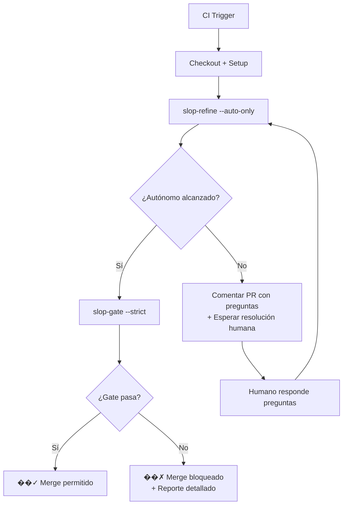

### Estrategia 2: Solo Deriva Nueva (Para ramas de desarrollo activo)

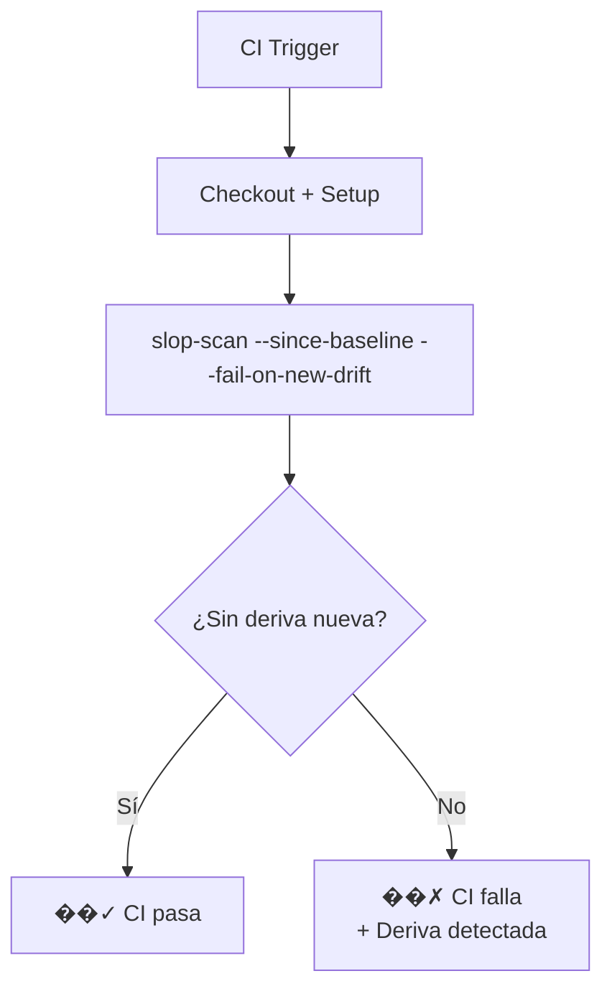

### Estrategia 3: Reporte Periódico (Para monitoreo de tendencia)

```mermaid
flowchart TD
    A[Cron Job Diario] --> B[Checkout + Setup]
    B --> C[slop-scan --stats --json > daily-stats.json]
    B --> D[slop-scan --brand "X" --profile producto]
    D --> E[Comentario en issue/channel\ncon tendencia]
```

---

## Implementaciones por Plataforma

### GitHub Actions

#### Workflow Estricto (.github/workflows/slop-strict.yml)
```yaml
name: slop-strict-gate
on:
  pull_request:
    branches: [ main, develop ]
    types: [opened, synchronize, reopened]

jobs:
  slop-gate:
    runs-on: ubuntu-latest
    timeout-minutes: 10
    steps:
      - uses: actions/checkout@v4
      
      - name: Setup Node.js
        uses: actions/setup-node@v4
        with:
          node-version: '20'
          cache: 'npm'
      
      - name: Install dependencies
        run: npm ci
      
      - name: Ejecutar refinamiento autónomo
        id: refine
        run: |
          node scripts/slop-refine.mjs ./src --brand "MiMarca" --profile producto --auto-only
          echo "state=$([ -f .slop/refinement-state.json ] && cat .slop/refinement-state.json)" >> $GITHUB_ENV
      
      - name: Comentar PR si se necesita intervención humana
        if: env.state && contains(env.state, '"estado":"esperando_humano"')
        uses: actions/github-script@v7
        with:
          script: |
            const state = JSON.parse(process.env.state);
            let body = '## �� 🤖 slop-tools: Se requiere revisión humana\\n\\n';
            body += 'Se han detectado problemas que requieren juicio experto:\\n\\n';
            
            state.preguntas_pendientes.forEach((p, index) => {
              body += `${index + 1}. **${p.hallazgo}** en \`${p.archivo || 'ubicación desconocida'}\`\\n`;
              body += `   - Tipo: ${p.tipo}\\n`;
              body += `   - Contexto: ${p.contexto || 'No disponible'}\\n`;
              body += `   - Sugerencia: ${p.sugerencia || 'Revisar manualmente'}\\n\\n`;
            });
            
            body += '---\\n';
            body += 'Para responder, comenta en este PR con:\\n';
            body += '`/slop-answer <pregunta-id> <opción>`\\n\\n';
            body += '*Este comentario se actualizará automáticamente a medida que se resuelvan las preguntas.*';
            
            github.rest.issues.createComment({
              owner: context.repo.owner,
              repo: context.repo.repo,
              issue_number: context.payload.pull_request.number,
              body
            });
      
      - name: Ejecutar gate estricto
        if: env.state && !contains(env.state, '"estado":"esperando_humano"')
        run: |
          node scripts/slop-gate.mjs ./src --strict --profile producto --brand "MiMarca"
      
      - name: Fallar si hay preguntas pendientes (opcional, para máximo rigor)
        if: env.state && contains(env.state, '"estado":"esperando_humano"')
        run: |
          echo "Error: Se requieren decisiones humanas antes de poder mergear"
          exit 1
```

#### Workflow Deriva Nueva (.github/workflows/slop-drift.yml)
```yaml
name: slop-drift-detection
on:
  push:
    branches: [ main, develop ]
  pull_request:
    branches: [ main, develop ]

jobs:
  drift-check:
    runs-on: ubuntu-latest
    steps:
      - uses: actions/checkout@v4
      
      - name: Setup Node.js
        uses: actions/setup-node@v4
        with:
          node-version: '20'
      
      - name: Install dependencies
        run: npm ci
      
      - name: Verificar que no haya deriva nueva desde baseline
        run: |
          # Asegurar que existe baseline (crearlo si no existe en ramas de feature)
          if [ ! -f .slop/baseline.json ]; then
            echo "Creando baseline inicial..."
            node scripts/slop-scan.mjs ./src --write-baseline
          fi
          
          # Verificar deriva nueva
          node scripts/slop-scan.mjs ./src --since-baseline --fail-on-new-drift
        # Nota: este comando exit 1 si hay deriva nueva
```

#### Workflow Reporte Diario (.github/workflows/slop-report.yml)
```yaml
name: slop-daily-report
on:
  schedule:
    - cron: '0 8 * * *'  # Todos los días a las 8:00 AM UTC
  workflow_dispatch:  # Permite ejecución manual

jobs:
  report:
    runs-on: ubuntu-latest
    steps:
      - uses: actions/checkout@v4
      
      - name: Setup Node.js
        uses: actions/setup-node@v4
        with:
          node-version: '20'
      
      - name: Install dependencies
        run: npm ci
      
      - name: Generar reporte de estadísticas
        id: stats
        run: |
          node scripts/slop-scan.mjs ./src --stats --json > slop-stats.json
          echo "stats<<EOF" >> $GITHUB_OUTPUT
          cat slop-stats.json
          echo "EOF"
          echo "summary<<EOF" >> $GITHUB_OUTPUT
          node scripts/slop-scan.mjs ./src --stats
          echo "EOF"
      
      - name: Publicar reporte en issue
        uses: actions/github-script@v7
        with:
          script: |
            const stats = JSON.parse(process.env.stats);
            const summary = process.env.summary;
            
            // Buscar issue existente o crear uno nuevo
            const { data: issues } = await github.rest.issues.listForRepo({
              owner: context.repo.owner,
              repo: context.repo.repo,
              state: 'open',
              labels: ['slop-report']
            });
            
            let issueNumber;
            if (issues.length > 0) {
              issueNumber = issues[0].number;
              // Actualizar issue existente
              await github.rest.issues.update({
                owner: context.repo.owner,
                repo: context.repo.repo,
                issue_number: issueNumber,
                body: `## �� 📊 Reporte Diario de slop-tools\n\n${summary}\n\nÚltima actualización: ${new Date().toISOString()}\n\n<details>\n<summary>Estadísticas completas</summary>\n\n\`\`\`json\n${JSON.stringify(stats, null, 2)}\n\`\`\`\n</details>`
              });
            } else {
              // Crear nuevo issue
              const response = await github.rest.issues.create({
                owner: context.repo.owner,
                repo: context.repo.repo,
                title: `���📊 Reporte Diario de slop-tools - ${new Date().toLocaleDateString()}`,
                body: `## �� 📊 Reporte Diario de slop-tools\n\n${summary}\n\nÚltima actualización: ${new Date().toISOString()}\n\n<details>\n<summary>Estadísticas completas</summary>\n\n\`\`\`json\n${JSON.stringify(stats, null, 2)}\n\`\`\`\n</details>`,
                labels: ['slop-report', 'automated']
              });
              issueNumber = response.data.number;
            }
            
            // Comentar que se actualizó
            await github.rest.issues.createComment({
              owner: context.repo.owner,
              repo: context.repo.repo,
              issue_number: issueNumber,
              body: `���🔄 Reporte actualizado automáticamente el ${new Date().toLocaleString()}`
            });
```

### GitLab CI

#### .gitlab-ci.yml
```yaml
stages:
  - test
  - slop-refine
  - slop-gate

variables:
  NODE_VERSION: "20"

.cache_npm: &cache_npm
  cache:
    key: "${CI_JOB_NAME}-${CI_COMMIT_REF_SLUG}-${CI_COMMIT_SHORT_SHA}"
    paths:
      - .npm/

.slop_base: &slop_base
  image: node:$NODE_VERSION
  before_script:
    - npm ci
  tags:
    - docker

slop_refine:
  stage: slop-refine
  <<: *slop_base
  <<: *cache_npm
  script:
    - node scripts/slop-refine.mjs ./src --brand "MiMarca" --profile producto --auto-only
    - |
      if [ -f .slop/refinement-state.json ] && grep -q '"estado":"esperando_humano"' .slop/refinement-state.json; then
        echo "Se requieren decisiones humanas - revisar merge request"
        exit 0  # No fallar, pero requerir intervención humana
      fi
  rules:
    - if: $CI_PIPELINE_SOURCE == "merge_request_event"
      when: on_success

slop_gate:
  stage: slop-gate
  <<: *slop_base
  <<: *cache_npm
  script:
    - node scripts/slop-gate.mjs ./src --strict --profile producto --brand "MiMarca"
  needs:
    - job: slop_refine
      artifacts: true
  rules:
    - if: $CI_PIPELINE_SOURCE == "merge_request_event"
      when: on_success
```

### Azure DevOps

#### azure-pipelines.yml
```yaml
trigger:
- main
- develop

pr:
- main
- develop

variables:
  NODE_VERSION: '20'

stages:
- stage: SlopRefine
  displayName: 'Slop Refinement'
  jobs:
  - job: Refine
    displayName: 'Ejecutar refinamiento autónomo'
    pool:
      vmImage: 'ubuntu-latest'
    steps:
    - task: NodeTool@0
      inputs:
        versionSpec: '$(NODE_VERSION)'
      displayName: 'Instalar Node.js'
    
    - script: |
        npm ci
      displayName: 'Instalar dependencias'
    
    - script: |
        node scripts/slop-refine.mjs ./src --brand "MiMarca" --profile producto --auto-only
      displayName: 'Refinamiento autónomo'
      env:
        BRAND: 'MiMarca'
        PROFILE: 'producto'
    
    - script: |
        if [ -f .slop/refinement-state.json ] && grep -q '"estado":"esperando_humano"' .slop/refinement-state.json; then
          echo "##vso[task.logissue type=warning]Se requieren decisiones humanas"
          echo "##vso[task.complete result=SucceededWithIssues]";
        fi
      displayName: 'Verificar estado de refinamiento'

- stage: SlopGate
  displayName: 'Slop Gate'
  dependsOn: SlopRefine
  condition: succeeded()
  jobs:
  - job: Gate
    displayName: 'Ejecutar gate estricto'
    pool:
      vmImage: 'ubuntu-latest'
    steps:
    - task: NodeTool@0
      inputs:
        versionSpec: '$(NODE_VERSION)'
      displayName: 'Instalar Node.js'
    
    - script: |
        npm ci
      displayName: 'Instalar dependencias'
    
    - script: |
        node scripts/slop-gate.mjs ./src --strict --profile producto --brand "MiMarca"
      displayName: 'Gate estricto'
```

---

## Manejo de Respuestas Humanas en CI

### GitHub Actions - Comentario de PR

Para manejar respuestas humanas vía comentarios de PR:

```yaml
# Añadir al workflow slop-strict-gate anterior:
- name: Procesar respuestas humanas de comentarios
  if: github.event_name == 'issue_comment' && github.event.comment.body.startsWith('/slop-answer')
  run: |
    # Parsear comentario: /slop-answer <pregunta-id> <valor>
    COMMENT_BODY="${{ github.event.comment.body }}"
    PREGUNTA_ID=$(echo "$COMMENT_BODY" | awk '{print $2}')
    VALOR=$(echo "$COMMENT_BODY" | cut -d' ' -f3-)
    
    echo "Procesando respuesta: $PREGUNTA_ID = $VALOR"
    
    # Aplicar respuesta
    node scripts/slop-refine.mjs ./src --apply-answer "$PREGUNTA_ID" --answer-value "$VALOR"
    
    # Volver a ejecutar refinamiento
    node scripts/slop-refine.mjs ./src --brand "MiMarca" --profile producto --auto-only
```

### Comentario de formato:
```
/slop-answer q-123abc456 reemplazar "Automatiza tus reportes en segundos"
/slop-answer q-789def012 eximir "Placeholder intencional para A/B test"
/slop-answer q-345ghi678 cambiar_perfil landing
```

---

## Buenas Prácticas

### 1. Baseline Management
```bash
# En ramas principales (main/develop):
# Crear baseline una vez por release significativa
node scripts/slop-scan.mjs ./src --write-baseline

# En ramas de feature:
# Heredar baseline de main o crear temporal
if [ "$CI_COMMIT_REF_NAME" != "main" ] && [ "$CI_COMMIT_REF_NAME" != "develop" ]; then
  # Copiar baseline de main si existe, sino crear nuevo
  if [ ! -f .slop/baseline.json ]; then
    git show main:.slop/baseline.json > .slop/baseline.json 2>/dev/null || \
    node scripts/slop-scan.mjs ./src --write-baseline
  fi
fi
```

### 2. Umbrales por Proyecto
Crear `.slop/ci-config.json`:
```json
{
  "umbrales": {
    "score_autonomo": 85,
    "max_alta_autonomo": 0,
    "max_dudosa_autonomo": 1,
    "max_iteraciones": 3
  },
  "gate_strict": true,
  "fail_on_new_drift": true,
  "notify_on_questions": true
}
```

### 3. Notificaciones
- **Slack/Teams**: Enviar mensaje cuando se requiera intervención humana
- **Email**: Reporte diario/semanal de tendencias
- **Issue Automático**: Crear issue cuando se detecte deriva persistente

### 4. Métricas de Calidad
Tracking en CI:
```bash
# Después de cada ejecución exitosa
node scripts/slop-scan.mjs ./src --stats --json >> .slop/ci-history.jsonl
```

Luego analizar tendencias:
- Score promedio por semana
- Tiempo medio para resolver preguntas humanas
- Tasa de fuga de deriva (derivas que llegan a main)
- Efectividad de los fixes seguros

---

## Troubleshooting

### Problema: CI falla por nodo versión
**Solución**: Especificar explícitamente la versión en el workflow:
```yaml
uses: actions/setup-node@v4
with:
  node-version: '20'  # o .nvmrc
```

### Problema: Baseline no detecta cambios legítimos
**Solución**: Re-escribir baseline después de cambios intencionales:
```bash
# Después de aprobado un cambio de diseño intencional:
git checkout main
node scripts/slop-scan.mjs ./src --write-baseline
git add .slop/baseline.json
git commit -m "chore: actualizar baseline de slop-tools tras actualización de diseño"
```

### Problema: Demasiado ruido en comentarios de PR
**Solución**: Agrupar preguntas o usar issue dedicado:
```yaml
# En lugar de comentar en cada PR, crear/actualizar issue:
- name: Actualizar issue de slop-tools
  if: env.state && contains(env.state, '"estado":"esperando_humano"')
  uses: actions/github-script@v7
  with:
    script: |
      // Crear o actualizar issue dedicado para slop-tools
      // Este enfoque reduce el ruido en PRs individuales
```

### Problema: Falsos positivos en deriva detection
**Solución**: Ajustar umbrales o usar `--exempt` para archivos conocidos:
```bash
node scripts/slop-scan.mjs ./src --since-baseline --fail-on-new-drift \
  --exempt "node_modules/**" \
  --exempt "dist/**" \
  --exempt "coverage/**"
```

---

## Recursos Adicionales

- [Tutorial Completo](../Tutorial-Completo.md) - Explicación detallada de conceptos
- [Bucle de Refinamiento](../Refinement-Loop.md) - Flujo iterativo autónomo + humano
- [Contrato de Diseño](../Design-System-Contract.md) - Personalización de tokens y reglas
- [API de Scripts](../API-Reference.md) - Referencia técnica de todos los comandos
- [Ejemplos Reales](../examples/) - Workflows pre-configurados para proyectos comunes# Inicio Rápido (5 minutos)

## Flujo resumido

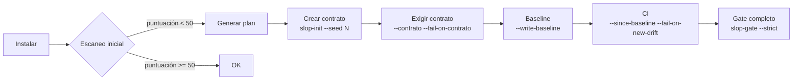

---

## 1. Clona y verifica
```bash
git clone https://github.com/cervantesh/slop-tools.git
cd slop-tools
node scripts/slop-scan.mjs --help
```

## 2. Escanea tu proyecto
```bash
cd /ruta/a/tu/proyecto
node /ruta/a/slop-tools/scripts/slop-scan.mjs ./src --brand "MiMarca" --profile producto
```

## 3. Si puntuación < 50 → genera plan
```bash
node /ruta/a/slop-tools/scripts/slop-scan.mjs ./src --brand "MiMarca" --profile producto --plan
```

## 4. Crea tu contrato de diseño
```bash
node /ruta/a/slop-tools/scripts/slop-init.mjs ./sistema --seed 42
# Edita ./sistema/DESIGN.md si quieres ajustar algo
```

## 5. Exige el contrato
```bash
node /ruta/a/slop-tools/scripts/slop-scan.mjs ./src --contrato ./sistema --fail-on-contrato
```

## 6. Baseline (una vez) + CI
```bash
# Local: congela estado actual
node /ruta/a/slop-tools/scripts/slop-scan.mjs ./src --write-baseline

# En tu CI (GitHub Actions, GitLab, etc.):
node /ruta/a/slop-tools/scripts/slop-scan.mjs ./src --since-baseline --fail-on-new-drift
```

---

## Comandos esenciales en una tabla

| Quiero... | Comando |
|-----------|---------|
| Ver puntuación y reglas que fallan | `slop-scan ./src --brand "X" --profile producto` |
| Plan de arreglo ordenado | `slop-scan ./src --brand "X" --profile producto --plan` |
| Generar sistema de diseño | `slop-init ./sistema --seed 42` |
| Verificar fidelidad al diseño | `slop-scan ./src --contrato ./sistema --fail-on-contrato` |
| Congelar hallazgos actuales | `slop-scan ./src --write-baseline` |
| CI: fallar solo ante lo nuevo | `slop-scan ./src --since-baseline --fail-on-new-drift` |
| Brief para agente (Cursor, Copilot...) | `slop-fix ./src --brand "X" --out REMEDIAR.md` |
| Aplicar fixes triviales seguros | `slop-fix ./src --apply-safe` |
| Pipeline completo CI | `slop-gate ./src --strict --profile producto --brand "X"` |
| Ver historial local | `slop-scan ./src --stats` |

---

## Perfiles: elige uno

```bash
# Landing page marketing
--profile landing

# App / Dashboard / SaaS
--profile producto

# Ambos
--profile ambos
```

## Géneros: declara tu intención estética

```bash
# Blog, docs, contenido largo
--genre editorial

# Minimalismo intencional (espaciado amplio, serif)
--genre modern-minimal

# Marca expresiva, gaming, kids
--genre playful

# Experiencia inmersiva, color vibrante
--genre atmospheric
```

---

## Ejemplo completo: proyecto React/Next.js

```bash
# 1. Escaneo inicial
node slop-scan.mjs ./src --brand "MiSaaS" --profile producto

# 2. Plan de remediación
node slop-scan.mjs ./src --brand "MiSaaS" --profile producto --plan

# 3. Crear contrato (semilla fija = reproducible)
node slop-init.mjs ./sistema --seed 12345

# 4. Verificar contrato
node slop-scan.mjs ./src --contrato ./sistema --fail-on-contrato

# 5. Baseline
node slop-scan.mjs ./src --write-baseline

# 6. GitHub Actions (.github/workflows/slop.yml)
# Ver wiki/CI-Integration.md
```

---

## Si algo falla

| Error | Solución |
|-------|----------|
| `command not found` | Usa ruta completa: `node /ruta/a/slop-tools/scripts/slop-scan.mjs` |
| `Node version < 18` | Actualiza Node: `nvm install 20` o descarga de nodejs.org |
| Puntuación 100 pero se ve mal | Revisa `--profile` y `--genre` correctos; lee `caveats.md` |
| Contrato falla en todo | Ajusta `DESIGN.md` a tu realidad; el contrato debe ser alcanzable |
| Baseline no detecta nuevos | Verifica `.slop/baseline.json` existe; identidad excluye número de línea |

---

## Siguiente paso

- [Tutorial Completo](Tutorial-Completo.md) — explicación profunda de cada paso
- [Bucle de Refinamiento](Refinement-Loop.md) — **flujo iterativo autónomo + humano** hasta converger
- [Integración CI](CI-Integration.md) — GitHub Actions, GitLab, Azure DevOps
- [Contrato de Diseño](Design-System-Contract.md) — tokens, DESIGN.md, personalización
- [Remediación](Remediation-Guide.md) — slop-fix, REMEDIAR.md, agent-remediate.md# Flujo de Refinamiento Iterativo (Human-in-the-Loop)

> **Objetivo**: Convertir slop-tools en un proceso autónomo *hasta donde sea seguro*, y escalar a humano solo cuando la ambigüedad lo requiera.

---

## Arquitectura del bucle

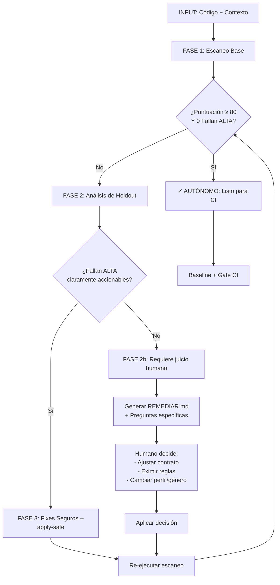

---

## Fases detalladas

### FASE 1: Escaneo Base (Autónoma)

```bash
node scripts/slop-scan.mjs ./src --brand "MiMarca" --profile producto --json > scan-1.json
```

**Criterio de salida autónoma:**
- `score ≥ 80` **Y**
- `alta.length === 0` **Y**
- `nuevos_desde_baseline === 0`

Si se cumple → **fin del bucle**, pasa a CI.

---

### FASE 2: Análisis de Holdout (Semi-autónoma)

```bash
node scripts/slop-scan.mjs ./src --brand "MiMarca" --profile producto --plan --json > plan.json
```

**Lee `plan.json` y clasifica cada hallazgo:**

| Categoría | Acción automática | Requiere humano |
|-----------|-------------------|-----------------|
| `validado J ≥ 0.4` + fix trivial (Inter, 300ms, radius) | `apply-safe` | No |
| `validado J ≥ 0.4` + fix no trivial (copy, estructura) | **No** | Sí — genera pregunta |
| `medido, no separa` | **No** | Sí — decidir si aplicar |
| `no medible` | **No** | Sí — juicio experto |

**Output automático:** `decisiones-automaticas.json` + `preguntas-humanas.json`

---

### FASE 2b: Preguntas al humano (Interactiva)

Para cada hallazgo no trivial, genera pregunta estructurada:

```json
{
  "hallazgo": "L1",
  "archivo": "src/components/Hero.jsx:23",
  "actual": "Elige tu experiencia",
  "pregunta": "Este copy genérico (L1, J=0.39) falla. ¿Cuál es el copy específico de tu marca?",
  "opciones": [
    { "accion": "reemplazar", "valor": "Automatiza tus reportes en segundos" },
    { "accion": "eximir", "razon": "Es un placeholder intencional para A/B test" },
    { "accion": "cambiar_perfil", "valor": "landing" }
  ],
  "contexto": "Regla L1: copy genérico de marketing. Precisión 89% en holdout."
}
```

**Herramienta sugerida:** `slop-ask.mjs` (por crear) que lee `preguntas-humanas.json` y presenta UI interactiva (CLI o web).

---

### FASE 3: Fixes Seguros (Autónoma)

```bash
node scripts/slop-fix.mjs ./src --apply-safe --json > fixes-aplicados.json
```

**Solo toca:**
- `font-family: Inter/Poppins/Geist/Roboto` → fuente de texto del contrato
- `transition: all 300ms` / `transition: all 0.3s` → duración + curva del contrato
- `border-radius: 4px|8px|12px|16px` → radio más cercano del contrato
- Colores hex hardcoded que matchean paleta por defecto → token OKLCH del contrato

**Nunca toca:**
- Copy, microcopy, contenido
- Estructura de componentes
- Lógica de negocio
- Decisiones de UX (estados vacíos, loading, error)

---

### FASE 4: Re-evaluación (Autónoma)

```bash
node scripts/slop-scan.mjs ./src --brand "MiMarca" --profile producto --json > scan-2.json
```

Compara `scan-1.json` vs `scan-2.json`:
- `alta` reducido → bien
- `alta` igual → necesita humano (FASE 2b)
- `nuevos` > 0 → **regression**, alerta inmediata

---

## Archivo de estado del bucle

`.slop/refinement-state.json`:

```json
{
  "version": 1,
  "iteracion": 3,
  "estado": "esperando_humano",
  "historial": [
    { "iteracion": 1, "score": 32, "alta": 2, "dudosa": 3, "accion": "aplicar_fixes_seguros" },
    { "iteracion": 2, "score": 58, "alta": 1, "dudosa": 2, "accion": "preguntar_humano_L1" },
    { "iteracion": 3, "score": 58, "alta": 1, "dudosa": 2, "accion": "esperando_respuesta" }
  ],
  "preguntas_pendientes": [
    { "id": "q-001", "hallazgo": "L1", "archivo": "src/components/Hero.jsx:23", "tipo": "copy" }
  ],
  "decisiones_humanas": [
    { "id": "q-001", "respuesta": "reemplazar", "valor": "Automatiza tus reportes en segundos", "timestamp": "2026-08-09T10:30:00Z" }
  ]
}
```

---

## Comandos del flujo completo

```bash
# 1. Iniciar/refinar (detecta estado previo en .slop/refinement-state.json)
node scripts/slop-refine.mjs ./src --brand "MiMarca" --profile producto

# 2. Solo fase autónoma (para CI nocturno)
node scripts/slop-refine.mjs ./src --brand "MiMarca" --profile producto --auto-only

# 3. Solo generar preguntas (para revisión en PR)
node scripts/slop-refine.mjs ./src --brand "MiMarca" --profile producto --gen-questions

# 4. Aplicar respuesta humana (desde PR comment / CLI)
node scripts/slop-refine.mjs ./src --apply-answer q-001 --answer-value "Automatiza tus reportes"

# 5. Ver estado
node scripts/slop-refine.mjs ./src --status
```

---

## Umbrales de autonomía (configurables en `.slop/refinamiento.json`)

```json
{
  "umbrales": {
    "score_autonomo": 80,
    "max_alta_autonomo": 0,
    "max_dudosa_autonomo": 2,
    "max_iteraciones": 5
  },
  "auto_fix": {
    "tipografia": true,
    "movimiento": true,
    "radios": true,
    "colores_hex_known": true
  },
  "escalado_humano": {
    "copy": "siempre",
    "estructura": "siempre",
    "estados_vacios": "si_J_lt_0.35",
    "microcopy_placeholder": "si_J_lt_0.35"
  }
}
```

---

## Integración con PR / Code Review

### GitHub Action sugerido

```yaml
# .github/workflows/slop-refine.yml
name: slop-refine
on:
  pull_request:
    types: [opened, synchronize, reopened]
  issue_comment:
    types: [created]

jobs:
  refine:
    runs-on: ubuntu-latest
    steps:
      - uses: actions/checkout@v4
      - uses: actions/setup-node@v4
        with: { node-version: '20' }
      - run: npm ci
      
      # Ejecutar refinamiento autónomo
      - id: refine
        run: |
          node scripts/slop-refine.mjs ./src --brand "MiMarca" --profile producto --auto-only
          echo "state=$(cat .slop/refinement-state.json | jq -c .)" >> $GITHUB_OUTPUT
      
      # Si hay preguntas, comentar en PR
      - if: fromJson(steps.refine.outputs.state).estado == 'esperando_humano'
        uses: actions/github-script@v7
        with:
          script: |
            const state = JSON.parse('${{ steps.refine.outputs.state }}');
            let body = '## 🤖 slop-tools: Requiere decisión humana\n\n';
            state.preguntas_pendientes.forEach(q => {
              body += `### ${q.hallazgo} en \`${q.archivo}\`\n`;
              body += `**Actual:** ${q.actual}\n\n`;
              body += `**Opciones:**\n`;
              q.opciones.forEach((o, i) => {
                body += `- \`${o.accion}\`: ${o.valor || o.razon}\n`;
              });
              body += `\n> Responde con: \`/slop-answer q-${q.id} <opcion>\`\n\n`;
            });
            github.rest.issues.createComment({
              owner: context.repo.owner,
              repo: context.repo.repo,
              issue_number: context.payload.pull_request.number,
              body
            });
      
      # Procesar respuestas /slop-answer
      - if: contains(github.event.comment.body, '/slop-answer')
        run: |
          # parsear comentario y ejecutar slop-refine --apply-answer
          node scripts/slop-refine.mjs ./src --apply-answer ...
```

### Comentarios de PR para decisiones

```
/slop-answer q-001 reemplazar "Automatiza tus reportes en segundos"
/slop-answer q-002 eximir "Placeholder intencional para A/B test"
/slop-answer q-003 cambiar_perfil landing
```

---

## Métricas de madurez del bucle

| Métrica | Objetivo | Significado |
|---------|----------|-------------|
| `% iteraciones autónomas` | > 70% | El bucle resuelve solo la mayoría |
| `preguntas/hallazgo ALTA` | < 0.5 | Solo lo realmente ambiguo escala |
| `tiempo humano/pregunta` | < 2 min | Preguntas bien formuladas |
| `regressions/iteración` | 0 | Fixes no rompen lo anterior |
| `score final vs inicial` | +40 pts | Mejora real, no solo gaming |

---

## Próximos pasos para implementar

1. **Crear `scripts/slop-refine.mjs`** — orquestador del bucle con estado persistente
2. **Crear `scripts/slop-ask.mjs`** — CLI interactivo para preguntas humanas
3. **Añadir `--json` a todos los comandos** — ya existe en slop-scan, extender a slop-fix, slop-init
4. **GitHub Action `slop-refine.yml`** — integra con PR comments
5. **Config `.slop/refinamiento.json`** — umbrales por proyecto

---

## Filosofía: "Autónomo hasta que duele"

```
┌─────────────────────────────────────────────────────────────┐
│  REGLA DE ORO:                                             │
│  Si la confianza de validación (J) ≥ 0.4 Y el fix es       │
│  trivial (token → token), actúa solo.                      │
│  Si J < 0.4 O el fix requiere juicio semántico, pregunta.  │
└─────────────────────────────────────────────────────────────┘
```

Esto evita dos fallos:
- **Falso autónomo**: IA "arregla" copy y empeora UX
- **Falso dependiente**: Humano pierde tiempo aprobando `Inter → Karla`# Tutorial Completo: slop-tools

> **Objetivo**: Convertir "esto parece hecho por IA" en comprobaciones contrastables con evidencia, y darte un contrato de diseño que impida la deriva.

---

## Índice

1. [Instalación y primer escaneo](#1-instalación-y-primer-escaneo)
2. [Leer la salida: puntuación, núcleo, holdout](#2-leer-la-salida-puntuación-núcleo-holdout)
3. [Plan de remediación ordenado](#3-plan-de-remediación-ordenado)
4. [Crear tu contrato de diseño (slop-init)](#4-crear-tu-contrato-de-diseño-slop-init)
5. [Exigir el contrato en tu código](#5-exigir-el-contrato-en-tu-código)
6. [Baseline: tolera lo viejo, vigila lo nuevo](#6-baseline-tolera-lo-viejo-vigila-lo-nuevo)
7. [Remediar con brief para agentes](#7-remediar-con-brief-para-agentes)
8. [Gate completo en CI](#8-gate-completo-en-ci)
9. [Observabilidad e historial](#9-observabilidad-e-historial)
10. [Perfiles y géneros](#10-perfiles-y-géneros)
11. [Validación empírica](#11-validación-empírica)
12. [Limitaciones y caveats](#12-limitaciones-y-caveats)

---

## Flujo general (Mermaid)

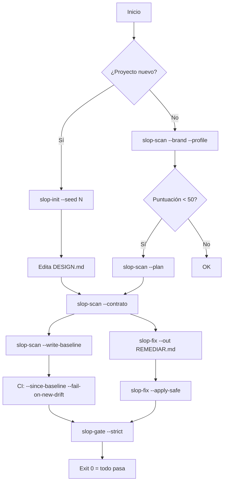

---

## 1. Instalación y primer escaneo

### Requisitos
- Node.js ≥ 18
- No hay dependencias npm

### Opción A: Usar desde el repo clonado
```bash
git clone https://github.com/cervantesh/slop-tools.git
cd slop-tools
node scripts/slop-scan.mjs --help
```

### Opción B: npm link (global)
```bash
cd slop-tools
npm link
# Ahora puedes usar: slop-scan, slop-init, slop-fix, slop-gate, slop-visual
```

### Primer escaneo en tu proyecto
```bash
cd mi-proyecto
node /ruta/a/slop-tools/scripts/slop-scan.mjs ./src --brand "MiMarca" --profile producto
```

---

## 2. Leer la salida: puntuación, núcleo, holdout

```
PUNTUACIÓN  32/100 — Se identifica en diez segundos
NÚCLEO      71/100 — solo 8 reglas de confianza alta (holdout)

── De qué fiarte (holdout) ──
Núcleo ALTA (8): CS3, D5, E7, L1, L2, P4, UX2, UX6
Fallan ALTA:    UX2, L2
Fallan DUDOSA:  C4, A1
→ Puedes apoyar un veredicto de «parece slop» en las ALTA.

── Prueba del cambio de nombre (marca: "MiMarca") ──
✗ 16 titular(es) que funcionarían para un competidor
    components/Hero.jsx:23  "Elige tu experiencia"
    components/Pricing.jsx:41  "La mejor opción para ti"
```

### Qué significa cada parte

| Métrica | Rango | Interpretación |
|---------|-------|----------------|
| **PUNTUACIÓN** | 0–100 | < 50 = identificable como slop; > 80 = limpio |
| **NÚCLEO** | 0–100 | Puntuación solo con 8 reglas validadas en holdout (J ≥ 0.4) |
| **Fallan ALTA** | Lista | Reglas que **sí discriminan** (precisión ≥ 90%, lift ≥ 10). Evidencia sólida. |
| **Fallan DUDOSA** | Lista | Reglas que en muestra funcionan pero en holdout caen. Pista, no prueba. |
| **Prueba cambio de nombre** | Conteos | Textos genéricos que no mencionan tu marca. Falla antes que todo lo visual. |

### Las 8 reglas de confianza alta (holdout)

| ID | Nombre | Qué detecta | J | Precisión |
|----|--------|-------------|---|-----------|
| CS3 | Estructura de landing canónica | nav + hero + features + testimonials + footer en ese orden | 0.41 | 93% |
| D5 | Emojis como iconos | 🎯 🚀 ✨ ⭐ 🔥 usados como UI icons | 0.41 | 93% |
| E7 | Gradientes de fondo decorativos | `bg-gradient-to-*` sin propósito semántico | 0.42 | 91% |
| L1 | Copy genérico de marketing | "Transforma tu...", "La solución definitiva...", "Potencia tu..." | 0.39 | 89% |
| L2 | Fechas/monedas hardcoded | `$19.99`, `January 15, 2024` sin Intl | 0.41 | 90% |
| P4 | Tailwind utility-only | 0 componentes con `@apply` o CSS propio | 0.38 | 87% |
| UX2 | Estados vacíos genéricos | "No hay datos", "Cargando..." sin contexto | 0.40 | 88% |
| UX6 | Microcopy de placeholder | "Lorem ipsum", "Tu nombre", "email@ejemplo.com" en producción | 0.39 | 89% |

---

## 3. Plan de remediación ordenado

```bash
node scripts/slop-scan.mjs ./src --brand "MiMarca" --profile producto --plan
```

**Salida:**

```
1 · CONTENIDO Y DATOS   6 hallazgos · peso 15
  L2 · Fechas y monedas escritas a mano   [validado J 0,415]
  Por que delata: Concatenar el simbolo rompe en cuanto cambia el mercado.
  Que hacer:      Intl.NumberFormat e Intl.DateTimeFormat con locale explicito.
  Donde:          src/components/Pricing.jsx:49, src/utils/format.js:192

2 · SISTEMA VISUAL   4 hallazgos · peso 12
  C4 · Radios uniformes (2/4/8/16)   [medido, no separa]
  Por que delata: Escala geométrica perfecta = plantilla.
  Que hacer:      Usa la escala de radios de tu contrato (2/6/14 o 3/8/18).
  Donde:          src/components/Button.jsx:3, src/components/Card.jsx:7
```

### Fórmula de ordenación
```
Prioridad = (peso_de_regla × confianza_de_validación) ÷ esfuerzo_estimado
```

- **Confianza en numerador** → el plan se apoya en lo medido, no en lo que las fuentes repiten
- **Sellos de evidencia** en cada hallazgo:
  - `validado J 0.41` → discriminación estadística real
  - `medido, no separa` → se mide pero no separa clases
  - `no medible` → juicio experto, sin validación cuantitativa

---

## 4. Crear tu contrato de diseño (slop-init)

```bash
node scripts/slop-init.mjs ./sistema --seed 42
```

**Output:**
```
sistema/
├── DESIGN.md           # Documento legible
├── tokens.css          # Variables CSS
├── tokens.json         # Tokens estructurados
└── .slop-init.json     # Metadatos
```

### DESIGN.md (ejemplo)
```markdown
# Sistema de Diseño — semilla 42

## Postura
técnica · esquema claro

## Color
- Tono base: teal (186°)
- Primario: oklch(0.55 0.15 186)
- Neutros: oklch(0.98 0 0) → oklch(0.15 0 0)

## Tipografía
- Display: Literata
- Texto: Karla

## Escala de espaciado
4 · 8 · 16 · 24 · 40

## Radios
2 · 6 · 14

## Movimiento
- Duración: 140ms
- Curva: cubic-bezier(.33,1,.68,1)
```

### Repertorios (lo que NO incluye)
- ❌ Inter, Poppins, Geist, Roboto, Open Sans (default de herramientas)
- ❌ Fraunces, Playfair, Instrument Serif + papel crema + terracota (kit AS9)
- ✅ 8 display + 7 texto curadas, 8 tonos fuera de banda 250–300° (A1), 5 escalas de radios/espaciado

### Divergencia verificada
```bash
# 10 invocaciones → 6 tonos distintos, 6 tipografías distintas, 0 pares idénticos
npm run bench  # incluye verifica-init.mjs
```

---

## 5. Exigir el contrato en tu código

### Flujo de validación de contrato

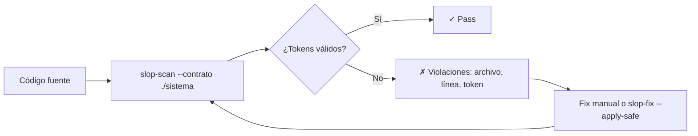

```bash
# Verifica fidelidad
node scripts/slop-scan.mjs ./src --contrato ./sistema

# En CI: falla si rompe contrato
node scripts/slop-scan.mjs ./src --contrato ./sistema --fail-on-contrato
```

### Qué valida `--contrato`

| Eje | Qué comprueba | Tolerancia |
|-----|---------------|------------|
| Tipografía | Solo `font-family` del contrato (display + texto) | 0 desviaciones |
| Paleta | Solo colores OKLCH del contrato + neutros | ΔE < 2 en OKLCH |
| Radios | Solo valores de la escala del contrato | Exacto |
| Espaciado | Solo valores de la escala del contrato | Exacto |
| Movimiento | `transition-duration` y `transition-timing-function` del contrato | Exacto |

**Ejemplo de fallo:**
```
CONTRATO ROTO (3 violaciones):
  src/components/Button.jsx:12  radius: 8px  →  contrato: 2|6|14
  src/components/Card.jsx:5     color: #6366f1  →  contrato: teal (oklch)
  src/app/globals.css:40        font-family: Inter  →  contrato: Literata/Karla
```

---

## 6. Baseline: tolera lo viejo, vigila lo nuevo

### Cómo funciona el trinquete (ratchet)

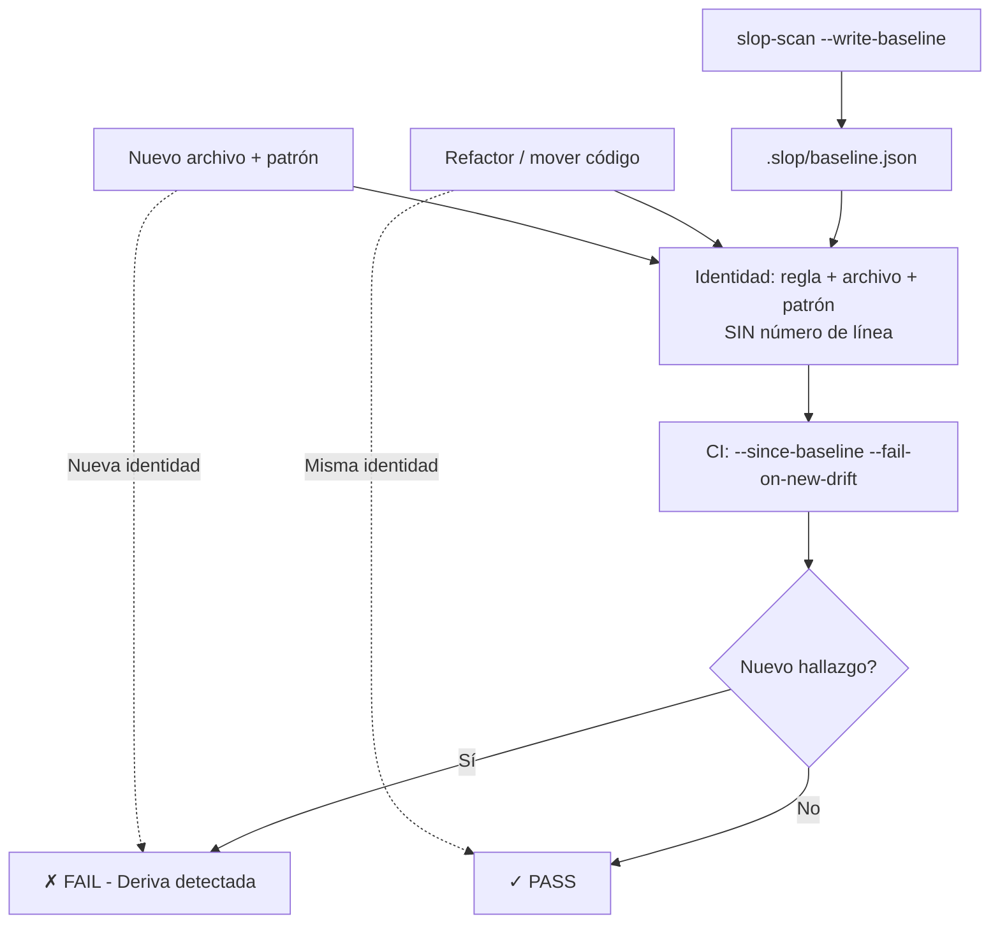

### Una vez: congela estado actual
```bash
node scripts/slop-scan.mjs ./src --write-baseline
```
Crea `.slop/baseline.json` con huellas de hallazgos (sin números de línea).

### En CI: falla solo ante deriva nueva
```bash
node scripts/slop-scan.mjs ./src --since-baseline --fail-on-new-drift
```

### Por qué funciona
- Identidad = `regla + archivo + patrón` (sin línea)
- Mover código ≠ nuevo hallazgo
- Refactor ≠ nuevo hallazgo
- Solo **nuevo patrón en nuevo archivo** = deriva

---

## 7. Remediar con brief para agentes

### Flujo de remediación

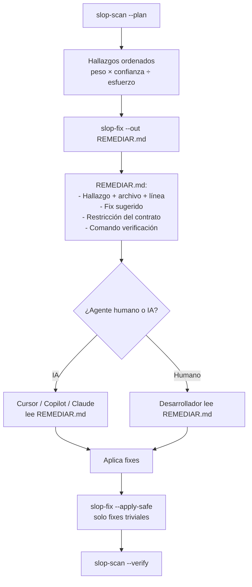

### Genera REMEDIAR.md
```bash
node scripts/slop-fix.mjs ./src --brand "MiMarca" --profile producto --out REMEDIAR.md
```

**Contenido de REMEDIAR.md:**
```markdown
# Plan de Remediación — MiMarca

## 1 · CONTENIDO Y DATOS (peso 15)
### L2 · Fechas y monedas [validado J 0.415]
**Archivos:** src/components/Pricing.jsx:49, src/utils/format.js:192
**Fix:** Intl.NumberFormat('es-ES', {style:'currency',currency:'EUR'})
**Contrato:** Usa locale del usuario (next-intl / react-i18next)

## 2 · SISTEMA VISUAL (peso 12)
### C4 · Radios [medido, no separa]
**Archivos:** src/components/Button.jsx:3, src/components/Card.jsx:7
**Fix:** radius: 6px (contrato) en lugar de 8px
**Contrato:** Radios permitidos: 2, 6, 14

---

## Comando de verificación
node scripts/slop-scan.mjs ./src --brand "MiMarca" --profile producto --contrato ./sistema --fail-on-contrato
```

### Aplica fixes triviales seguros
```bash
node scripts/slop-fix.mjs ./src --apply-safe
```

**Qué hace `--apply-safe`:**
- `font-family: Inter` → fuente de texto del contrato
- `transition: all 300ms` → duración + curva del contrato
- `border-radius: 8px` → radio más cercano del contrato
- **No toca**: lógica, copy, estructura, decisiones de producto

---

## 8. Gate completo en CI

### Pipeline --strict (Mermaid)

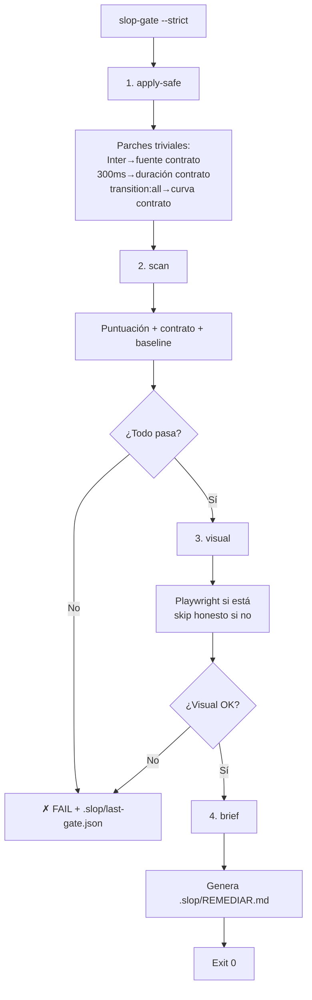

### Local
```bash
node scripts/slop-gate.mjs ./src --strict --profile producto --brand "MiMarca"
```

### GitHub Actions
```yaml
# .github/workflows/slop.yml
name: slop-gate
on: [push, pull_request]
jobs:
  gate:
    runs-on: ubuntu-latest
    steps:
      - uses: actions/checkout@v4
      - uses: actions/setup-node@v4
        with: { node-version: '20' }
      - run: npm ci
      - run: npx slop-tools@latest gate ./src --strict --profile producto --brand "MiMarca"
```

### Puertas que valida `--strict`
| Paso | Comando | Qué hace |
|------|---------|----------|
| 1 | `apply-safe` | Parches triviales |
| 2 | `scan` | Puntuación + contrato + baseline |
| 3 | `visual` | Regression visual (Playwright si está) |
| 4 | `brief` | Genera `.slop/REMEDIAR.md` |

**Exit 0 solo si todas pasan.** Escribe `.slop/last-gate.json` y `.slop/REMEDIAR.md`.

---

## 9. Observabilidad e historial

```bash
node scripts/slop-scan.mjs ./src --stats
```

**Salida:**
```
Historial local (.slop/history.jsonl) — últimos 10:

2026-08-09 10:15  score=32  nucleo=71  alta=2  dudosa=3  nuevos=0  drift=0
2026-08-08 14:22  score=28  nucleo=65  alta=3  dudosa=4  nuevos=2  drift=1  ← PR #234
2026-08-07 09:00  score=41  nucleo=78  alta=1  dudosa=2  nuevos=0  drift=0
2026-08-06 16:45  score=35  nucleo=70  alta=2  dudosa=3  nuevos=1  drift=0
```

- **Sin red, sin telemetría** — archivo local `.slop/history.jsonl`
- Úsalo para ver tendencias, no para comparar versiones (el denominador cambia)

---

## 10. Perfiles y géneros

### Decisión de perfil y género

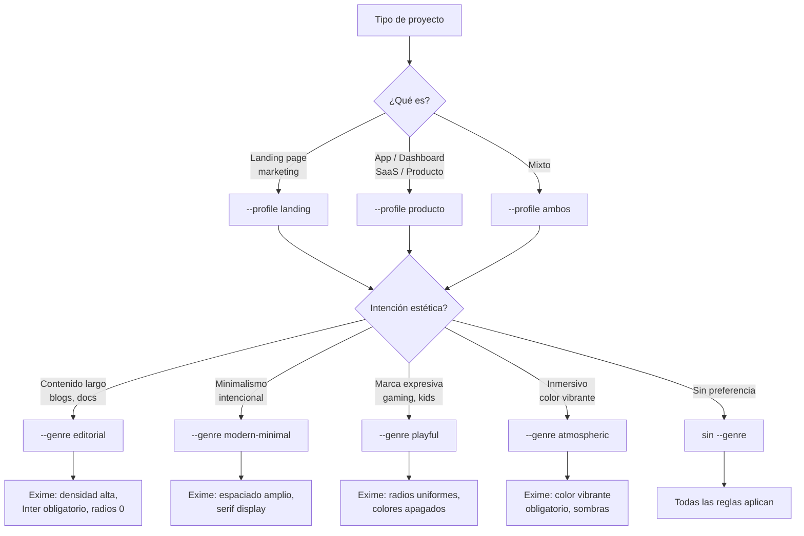

### Perfiles (qué reglas aplican)
| Flag | Uso | Qué filtra |
|------|-----|------------|
| `--profile landing` | Landing pages marketing | Solo reglas de landing |
| `--profile producto` | Apps, dashboards, SaaS | Solo reglas que transfieren a producto (i18n, estados, dominio) |
| `--profile ambos` | Mixto | Todo |

### Géneros (qué reglas exime por intención estética)
| Flag | Exime reglas de... | Para proyectos... |
|------|-------------------|-------------------|
| `--genre editorial` | Densidad alta, Inter obligatorio, radios 0 | Blogs, docs, contenido largo |
| `--genre atmospheric` | Color vibrante obligatorio, sombras dramáticas | Experiencias inmersivas |
| `--genre modern-minimal` | Espaciado amplio, serif display | Minimalismo intencional |
| `--genre playful` | Radios uniformes, colores apagados | Marcas expresivas, gaming, kids |

**Ejemplo:**
```bash
# Blog técnico con diseño editorial
node scripts/slop-scan.mjs ./src --profile landing --genre editorial --brand "MiBlog"

# SaaS B2B
node scripts/slop-scan.mjs ./src --profile producto --brand "MiSaaS"
```

---

## 11. Validación empírica (corre tú mismo)

### Flujo de validación (bench + corpus)

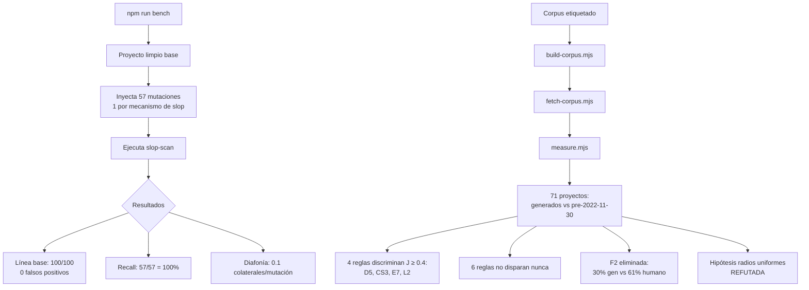

### Bench: mutaciones inyectadas
```bash
npm run bench
```
```
LINEA BASE (proyecto limpio)   puntuacion 100/100
Reglas que disparan sin slop:  ninguna

RECALL  57/57 mutaciones detectadas (100%)
Diafonia media: 0.1 reglas colaterales por mutacion
```

- Parte de proyecto limpio → inyecta 57 patrones de slop (uno por mecanismo) → verifica que la regla objetivo dispara
- **0 falsos positivos** en base limpia
- **100% recall** en mutaciones
- **Diafonía 0.1** → reglas no se solapan

### Corpus etiquetado: 71 proyectos
```bash
node research/build-corpus.mjs && node research/fetch-corpus.mjs && node research/measure.mjs
```

**Resultado:**
- 71 proyectos: generados (`lovable-tagger`, `v0.dev`, `bolt.new`) vs humanos **pre-2022-11-30**
- **4 reglas discriminan con significación** (J ≥ 0.4): D5, CS3, E7, L2
- 6 reglas no disparan nunca
- 1 regla disparaba al revés (F2: 30% generado vs 61% humano) → **eliminada**
- Hipótesis "IA produce radios uniformes" → **refutada** (datos dicen lo contrario)

Ver informe completo: `research/RESULTADOS.md`

---

## 12. Limitaciones y caveats

> **Lee `references/caveats.md` antes de dar un veredicto.**

| Limitación | Qué significa |
|------------|---------------|
| Análisis estático | No renderiza, no mide contraste real, no prueba interacción |
| No APCA | Usa WCAG 2 ratio + pre-checks OKLCH baratos |
| Puntuaciones no comparables entre versiones | Añadir comprobaciones cambia denominador → usa trinquete para evolución |
| Fuentes = landing pages marketing | `--profile producto` filtra lo que no transfiere, pero juicio final es humano |
| Rúbrica = consenso profesional | No investigación académica. Envejece con modas. |
| Puntuación = inicio de conversación | No veredicto. 14 casos documentados donde la rúbrica se equivoca (`caveats.md`) |

### Casos donde la rúbrica falla (resumen)
1. **Diseño brutalista intencional** → penaliza densidad, radios 0, tipografía mono
2. **Marcas con identidad visual fuerte** (ej. Linear, Vercel) → "genérico" por ser reconocible
3. **Prototipos / internal tools** → copy placeholder, estados vacíos simples son correctos
4. **White-label / multi-tenant** → copy genérico es feature, no bug
5. **Accesibilidad extrema** → alto contraste, radios 0, motion-reduce forzado

---

## Próximos pasos

1. **Ejecuta el bench** → `npm run bench` para verificar tu instalación
2. **Escanea tu proyecto** → anota `Fallan ALTA`
3. **Genera contrato** → `slop-init ./sistema --seed 42`
4. **Ajusta DESIGN.md** → hazlo tuyo
5. **Exige contrato** → `--contrato ./sistema --fail-on-contrato` en CI
6. **Baseline** → `--write-baseline` una vez, `--since-baseline` en CI
7. **Implementa bucle de refinamiento** → ver [Refinement-Loop.md](Refinement-Loop.md)

---

## Referencias rápidas

| Archivo | Qué contiene |
|---------|--------------|
| `data/rules.json` | 40 reglas declarativas (patrón, umbral, why, fix, source, validado) |
| `scripts/lib/checks.mjs` | 26 comprobaciones programáticas |
| `references/rubric.md` | 42 criterios revisión humana (general) |
| `references/producto.md` | 24 criterios específicos de producto |
| `references/caveats.md` | **Léelo antes de veredicto** — 14 casos donde falla |
| `references/remediation.md` | 6 reglas correctivas y orden de arreglo |
| `research/RESULTADOS.md` | Validación empírica completa |
| `.github/workflows/slop-scan.yml` | Ejemplo CI |